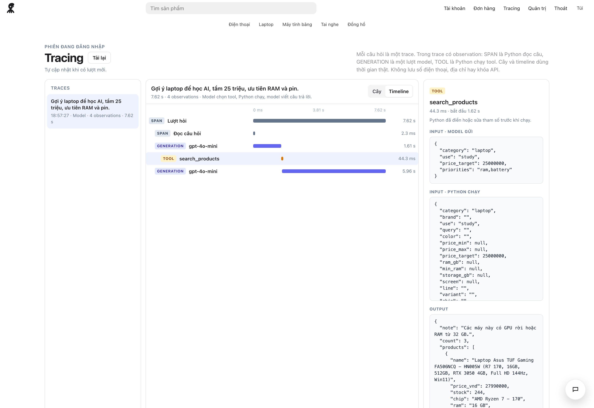
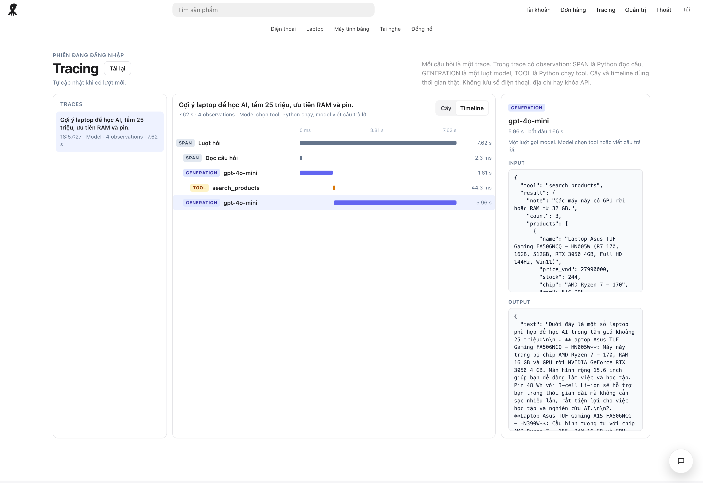

# Octopus Store

Octopus Store is a Vietnamese storefront for phones, laptops, headphones, tablets, and smartwatches. Prices come from a scrape of [Thế Giới Di Động](https://www.thegioididong.com/) and are Ho Chi Minh City reference prices. Checkout is simulated: nothing is charged.

The customer assistant is a tool loop. The model chooses a tool, Python runs it against PostgreSQL, and the model writes the reply. An admin can open a trace of that loop.

This branch is version 2. Version 1, Apple Store Online, is compared in [`VERSIONS.md`](VERSIONS.md). A public demo of this version runs on AWS at https://octopus-store.solanai.us/.

## A traced customer turn

This trace is one live admin question: “Gợi ý laptop để học AI, tầm 25 triệu, ưu tiên RAM và pin.” The turn took 7.62 seconds. The model called `search_products`, Python filled the empty arguments and returned three in-stock laptops, and the model wrote the reply from that list. No order was placed.



The same turn, with the final model call selected. The output is the text the shop shows.



One question is one trace. Inside it:

| Observation | What it is |
| --- | --- |
| `SPAN` | Python read the question and the recent chat. This is not a model call. |
| `GENERATION` | One model round. The bar is the measured latency. |
| `TOOL` | Python ran the tool the model chose. The detail pane shows the arguments the model sent and the arguments Python actually ran. |

The page keeps the current admin session only: at most 12 traces, in memory, cleared with the chat. It does not store a phone number, address, email, or the API key. It refreshes when a new turn is stored, and **Reload** forces a refresh. Guests are sent to login. A customer account gets “Chỉ quản trị xem được trang này.” The old path `/trace` redirects to `/tracing`. If the API is missing or fails, the trace is labeled offline.

## What the shopper sees

The shopper asks in the assistant. The reply is a short recommendation and product cards. Each card has a photo, the specs, the price, the stock, and a button that starts an order in the same thread.


The order is written only after the shopper submits the delivery form. Payment is simulated. This confirmation is order 11, placed from that recommendation: one Asus TUF Gaming, delivered on the afternoon of 1 October 2026, cash on delivery.


## Live loop

The customer message goes to the model. Python does not choose the tool. The loop stops after four rounds.

```text
Customer
  → OpenAI-compatible chat model
      → tool call
          search_products
          get_product
          compare_products
          check_inventory
          list_orders
          prepare_checkout
      → Python runs that tool on PostgreSQL
      → tool result goes back to the model
      → another tool call, or the final reply
```

`backend/agent/model.py` owns the loop and the tool schema. `backend/agent/tools.py` runs the tool the model named and returns JSON. The model never receives SQL.

`route.py` and `policy.py` do not run in front of the model. They score the 500 offline customer cases, and they are the fallback when the API key is missing or the call fails. The eval does not call the model and does not place an order.

## What Python still decides

The model chooses the tool. Python keeps the catalog numbers and the shop rules.

| Responsibility | Where |
| --- | --- |
| Fill arguments the model left empty, from this sentence and the one before it | `backend/agent/slots.py` |
| SQL, in-stock filter, and a ranking of at most four cards | `backend/agent/retrieve.py` |
| Checkout form, only after the model calls `prepare_checkout` | `backend/server.py` |
| Save the order and send the invoice after the customer submits | `backend/invoice.py` |

A follow-up that asks for the cheapest option, and does not name a new price, drops the previous budget. For study laptops, that list is the cheapest in-stock machines that still have a discrete GPU or at least 32 GB of RAM. A “around X million” question keeps machines inside the budget first and machines just outside it after.

A product card shows the photo, specs, price, and stock, then a short paragraph about that machine. The tool payload gives the model the name, price, stock, chip, RAM, storage, battery, charging, screen, and GPU. Color is asked only when the customer is closing a purchase.

| Tool | When |
| --- | --- |
| `search_products` | Search and recommend. The shop shows at most four cards. Eval also scores cutoffs of 10 and 20. |
| `get_product` | The customer names one product or one configuration. |
| `compare_products` | Compare two products. Figures come from the catalog. |
| `check_inventory` | How many units are in stock. |
| `list_orders` | Orders for the signed-in session only. |
| `prepare_checkout` | Open the checkout form. This does not create an order. |
| refusal | Delete, edit the database, read someone else’s order, or skip the instructions. This is not a model tool. |

An order is written only after the customer submits name, email, phone, address, delivery date, and delivery window. Windows are morning 8–12, afternoon 13–17, and evening 18–21. The earliest day is tomorrow, and the latest is 14 days out. A failed SMTP send keeps the order. The code on the receipt is the order id, not a bank QR.

## Admin assistant

`backend/admin_agent/` is a separate package. `route.py` is the offline router. `reports.py` is read-only: summary, sales, inventory, orders, and the review queue. `answer.py` is the model loop. The admin eval does not call the model. There is no write tool. Cancelled orders are excluded from revenue.

The two assistants are not one score. The customer eval measures product help. The admin eval measures store reports.

## Offline evaluation

```bash
.venv/bin/python eval/client/evaluate.py
.venv/bin/python eval/admin/evaluate.py
```

Each command writes a report in its own directory. Neither calls the API, calls `place_order`, nor changes stock. `eval/client/baseline/` is the run from before the slot reader was fixed. A new run does not overwrite it. The middle column has no separate file. Those numbers live in [`eval/client/README.md`](eval/client/README.md).

Same 500 customer cases:

| Metric | Baseline | After the slot fix | After the router |
| --- | ---: | ---: | ---: |
| Intent | 58.0 | 55.0 | 100.0 |
| Argument | 92.9 | 96.5 | 100.0 |
| Exact argument match | 80.5 | 85.3 | 100.0 |
| Tool selection | 49.6 | 49.6 | 100.0 |
| Precision@4 | 63.5 | 77.8 | 96.0 |
| Recall@4 | 10.4 | 19.5 | 27.0 |
| MRR | 0.635 | 0.778 | 0.96 |
| Hit@4 | 63.5 | 77.8 | 96.0 |
| Requirement satisfaction | 91.2 | 91.2 | 91.2 |
| Task success | 50.2 | 59.8 | 87.2 |
| Unauthorized | 0.0 | 0.0 | 0.0 |

The router run also records Recall@10 **42.0**, Recall@20 **58.7**, Hit@10 **96.0**, and Hit@20 **96.0**, on 126 cases that have at least one correct product in the catalog.

How to read the table:

- The baseline missed because slots were wrong and comparison, inventory, checkout, and refusal had no tool yet. Tool selection at 49.6 is that older tool set.
- Intent drops in the middle column because `256GB` is no longer read as RAM, and `Pro` on an iPhone is no longer read as a MacBook line.
- Hit@4 equals Hit@20. No case misses the top 4 and then hits inside the top 20. Recall@4 stays low because the labeled set averages 47.6 products while the shop shows 4 cards. Every card that is returned is in the labeled set. Precision@4 is 96.0 because five empty lists score 0.
- The 64 cases that miss task success are catalog gaps: no MacBook M4, no iPhone 17 Pro 512GB, no iPhone 15 Plus, no iPhone 14, no Galaxy A55 or A56, and no discrete-GPU laptop under 20 million. Those cases still select the right tool.
- Requirement satisfaction, 91.2, is scored only on study recommendations. Card order near the budget is preserved.
- 87.2 is the offline router. The prose on the live chat is not part of that number. The trace above is that prose.

Task success by group on the router run: search 83.3, detail 65.0, comparison 91.7, recommendation 91.4, inventory 100, orders 100, checkout 100, safety 100.

Admin eval, 84 cases:

| Metric | Score |
| --- | ---: |
| Intent | 86.9 |
| Argument | 87.4 |
| Exact argument match | 86.7 |
| Tool selection | 81.0 |
| Task success | 81.0 |
| Unauthorized | 0.0 |

Summary, sales, and the review queue are 100. The rest is the router: `máy tính` is not yet read as laptop, `còn hàng không` is not yet an inventory check, `hết hàng và sắp hết` returns one report, and `đơn số 3` is not split into an id. Eight prompts that ask to delete or edit data fall through to a read, so that group’s task score is 0. Unauthorized actions stay at 0. None of those prompts write to the database.

Metric definitions are in [`eval/client/README.md`](eval/client/README.md) and [`eval/README.md`](eval/README.md).

## Layout

| Path | Role |
| --- | --- |
| [`backend/agent/model.py`](backend/agent/model.py) | Live tool loop |
| [`backend/agent/tools.py`](backend/agent/tools.py) | Runs the tool the model chose |
| [`backend/agent/retrieve.py`](backend/agent/retrieve.py) | SQL and ranking |
| [`backend/agent/slots.py`](backend/agent/slots.py) | Fills arguments the model left empty |
| [`backend/agent/route.py`](backend/agent/route.py) | Offline router, and the fallback when the API is down |
| [`backend/agent/policy.py`](backend/agent/policy.py) | Offline gate. The live chat does not read this file |
| [`backend/admin_agent/`](backend/admin_agent/) | Admin router and reports |
| [`backend/server.py`](backend/server.py) | Store pages, login, orders, tracing |
| [`backend/invoice.py`](backend/invoice.py) | HTML invoice over SMTP |
| [`eval/client/`](eval/client/) | 500 customer cases and the baseline |
| [`eval/admin/`](eval/admin/) | 84 admin cases |
| [`frontend/`](frontend/) | CSS and JavaScript. Python renders the HTML |
| [`database/schema.sql`](database/schema.sql) | Catalog tables |
| [`api/suggest.py`](api/suggest.py) | Search-box suggestions |
| [`scraper/`](scraper/) | Catalog crawl. It does not serve the shop |
| [`docs/`](docs/) | Trace screenshots used above |
| [`VERSIONS.md`](VERSIONS.md) | Version 1 compared with this store |
| [`deploy/aws/`](deploy/aws/) | AWS demo: bootstrap and operator notes |

```bash
.venv/bin/python backend/test_agent.py
.venv/bin/python backend/test_invoice.py
```

Those two commands do not call the API and do not write an order.

## Deployed on AWS

The demo is https://octopus-store.solanai.us/. It is this same store, not a second codebase.

One EC2 `t4g.small` in `ap-southeast-1` runs Ubuntu 24.04. PostgreSQL 18 is on that machine. The app listens on `127.0.0.1:8765` under systemd. Caddy terminates HTTPS and proxies to that port. Cloudflare proxies the `octopus-store` name. The security group accepts TCP 80 and 443. Administration is AWS Systems Manager. SSH is not open. The EBS volume is encrypted.

Catalog rows, product images, and the demo customer accounts were copied from the local machine. Local orders and sessions were not. Checkout on the site is still simulated. The model key lives on the instance, outside this repository. If that call fails, the page uses the offline router.

The instance is on the AWS Free Plan. The site stops when that plan or its credit ends. The model API is a separate provider and is not covered by the AWS credit. Resource ids, the bootstrap script, and the operator commands are in [`deploy/aws/README.md`](deploy/aws/README.md).

## Run

Local PostgreSQL, database `tgdd_products`.

```bash
python3 -m venv .venv
.venv/bin/pip install -r requirements.txt
psql -d tgdd_products -f database/schema.sql
.venv/bin/python backend/server.py
```

Open http://127.0.0.1:8765. Login and registration both return to the home page. A reload keeps the session.

| Role | Email | Password | Name on this demo |
| --- | --- | --- | --- |
| Customer | `khach@form.local` | `form-khach` | Bảo |
| Admin | `admin@form.local` | `form-admin` | Quản trị |

The customer row is inserted only when it is missing. A fresh insert is named Khách. This demo database has already been renamed to Bảo.

`.env` lives at the repository root and is not committed:

```bash
OPENAI_API_KEY=
base_url=https://api.openai.com/v1
OPENAI_MODEL=gpt-4o-mini
SMTP_HOST=smtp.gmail.com
SMTP_PORT=587
SMTP_USER=
SMTP_PASSWORD=
```

`base_url` is any chat-completions endpoint. With `SMTP_USER` and `SMTP_PASSWORD` empty, the order is still saved and the receipt says the invoice was not sent. To restart, stop the process listening on port 8765 first.

`server.py` creates the account, session, order, and chat tables on startup. Those tables are not fully described in `database/schema.sql`.

## Limits

- The catalog is a scraped snapshot, not a live warehouse. A product that is not in the catalog is a missed task.
- There is no vector database. Search is slots, SQL, and ranking in code.
- 87.2 measures the offline router. The sentence in the chat is the model’s sentence, and `/tracing` shows it.
- The admin router has no refusal branch. The 81.0 score keeps that gap so a later run can be compared.

## Data

The schema is [`database/schema.sql`](database/schema.sql). Prices are integer VND. `price_vnd` prefers the detail-page price once that page has been read. The view `agent_product_catalog` gathers specs, images, variants, and reviews. Agents filter `is_live_catalog = true` when they should only suggest products that are on sale.

| Table | Contents |
| --- | --- |
| `products` | Category, name, brand, URL, price, condition, full-text search column |
| `product_specifications` | Spec key and value |
| `product_variants` | Storage and configuration |
| `product_images` | Files downloaded under `data/images` |
| `product_offers`, `product_reviews`, `price_history` | Promotions, sample reviews, price over time |
| `discovery_urls`, `sitemap_pages`, `crawl_runs`, `crawl_errors` | Crawl queue and checkpoints |

Crawl again, or resume a run that stopped:

```bash
.venv/bin/python scraper/tgdd_scraper.py --mode all
.venv/bin/python scraper/tgdd_scraper.py --mode details --only-listed --max-details 100
.venv/bin/python scraper/tgdd_scraper.py --mode images
```

`--mode` accepts `categories`, `catalog`, `supplement`, `sitemap`, `details`, and `images`. The crawler waits at least five seconds between requests and records finished URLs in PostgreSQL. `--retry-errors` retries failed URLs. Images land in `data/images/<category>/<id>/`.

```sql
SELECT source_product_id, name, brand, price_vnd
FROM products
WHERE category = 'laptop'
  AND is_live_catalog
  AND search_vector @@ plainto_tsquery('simple', 'asus vivobook')
  AND price_vnd BETWEEN 15000000 AND 25000000
ORDER BY price_vnd;
```

Keep the source URL when writing about a product. Use the data only within the terms that allow it.
