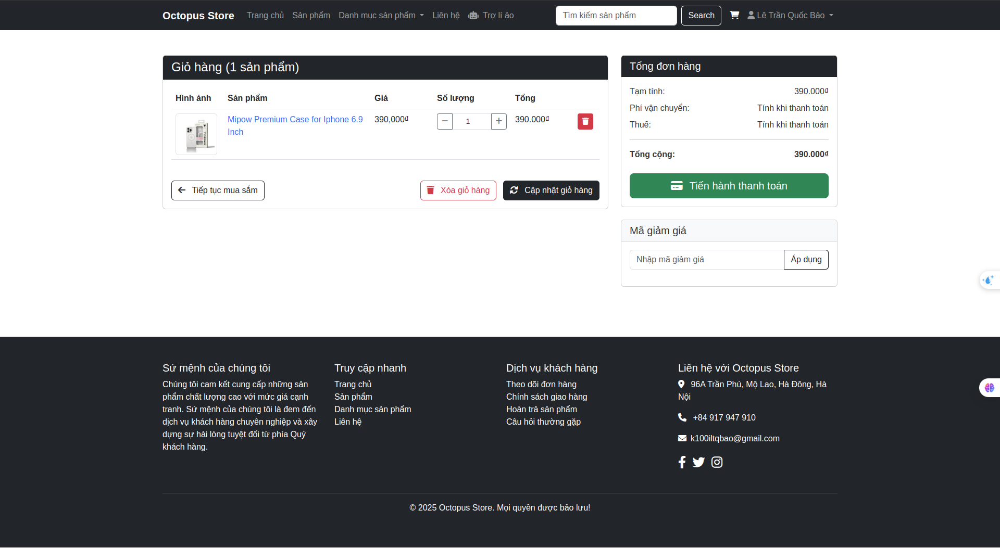
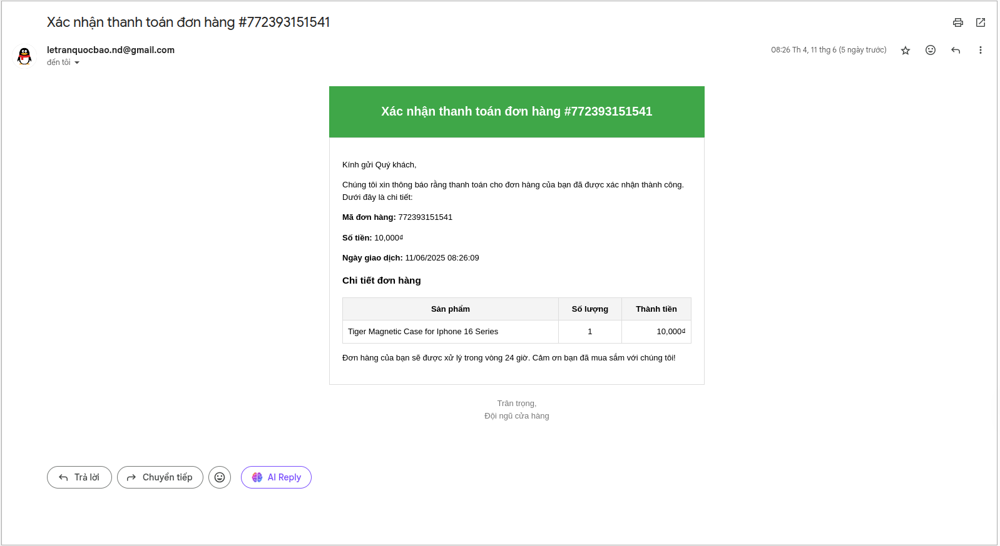
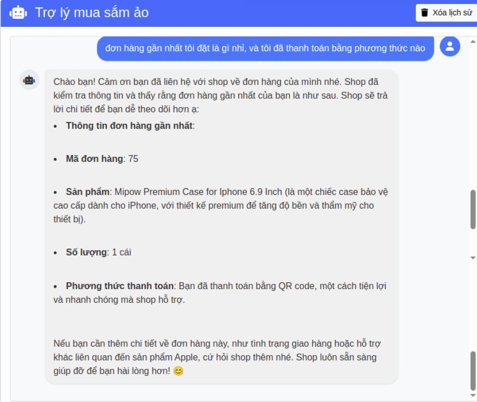
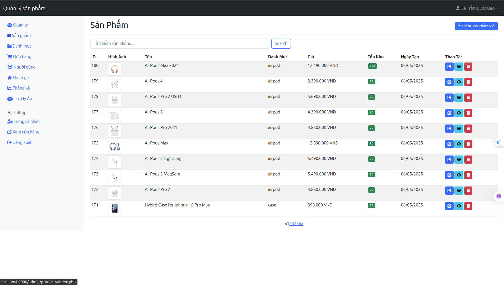
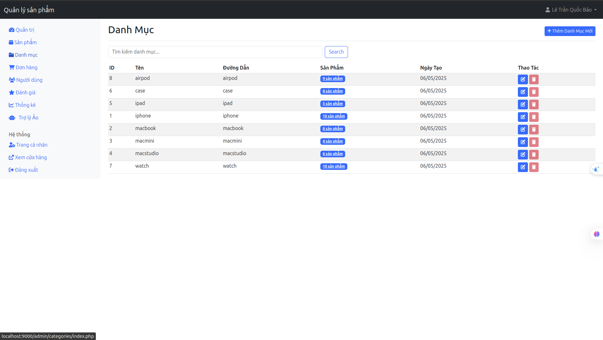
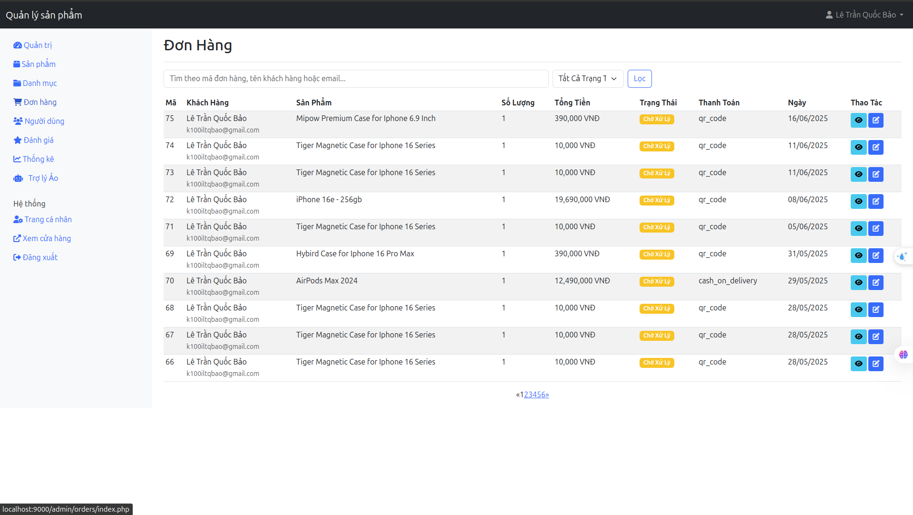
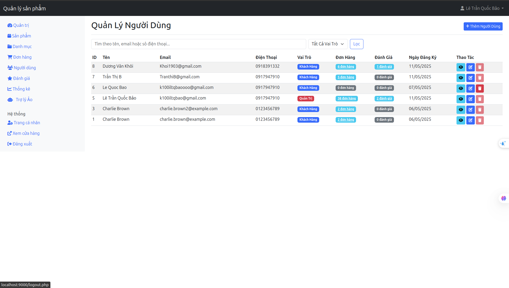
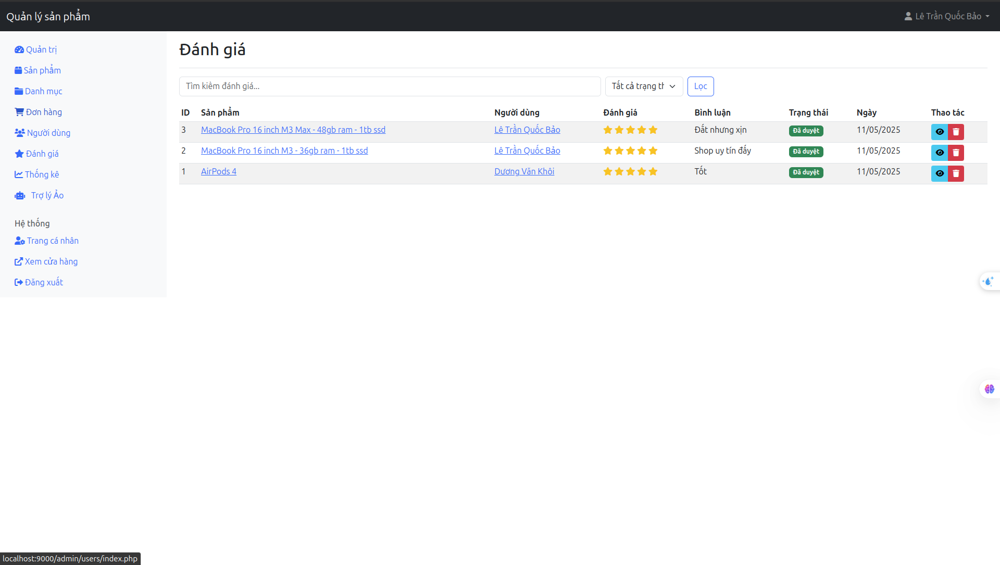

# 🍎 Apple Store Online

Welcome to the **Apple Store Online** project! This repository documents the development of an e-commerce website designed specifically for selling Apple products. The platform aims to deliver a seamless, secure, and user-friendly shopping experience for Apple fans, featuring product browsing, secure payments, automated notifications, and AI-powered customer support.

---

## 📋 Project Overview

The **Apple Store Online** project focuses on creating a fully functional online store tailored to Apple products. Key functionalities include an intuitive product catalog, a robust shopping cart system, integration with payment gateways, email automation for user engagement, and a smart chatbot to assist customers. This repository serves as the central hub for tracking progress, storing weekly reports, and managing the codebase.

---
# Tutorial
    git clone https://github.com/quocbao2772004/AppleStore.git
    cd code
    php -S localhost:9000
    cd controllers 
    uvicorn full_api:app --host 0.0.0.0 --port 4070 --reload

Note: 
Fill in all your information in the code/controllers/config.py file

---
## Experience it live on 
https://baitap3.toanphatnd.com/
---
# UseCase 
## Customer

## Admin

---

# Preview
## Home page

## Products

## Cart 

## Payment

## Send email when payment is successfull

## Virtual Assistant for customers

## Admin

## Admin AI

## 👨‍💻 Contributor

- **Lê Trần Quốc Bảo**  
  - **Student ID:** B22DCVT050  
  - **Class:** E22CQCN05-B  
  - **Institution:** Posts and Telecommunications Institute of Technology

